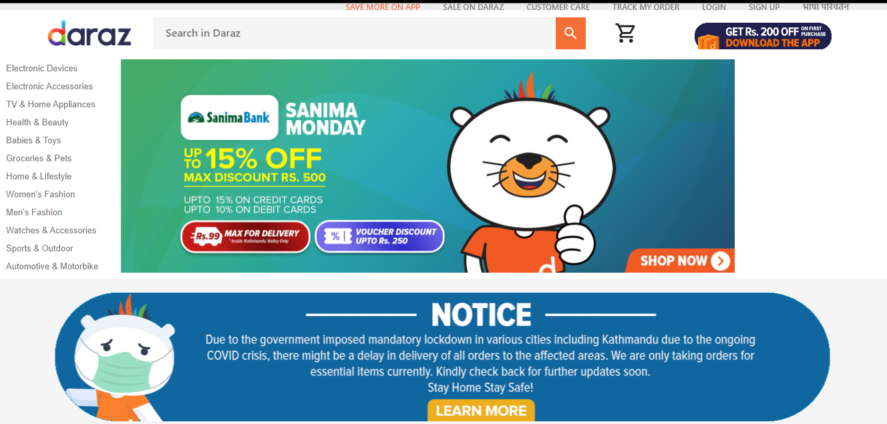
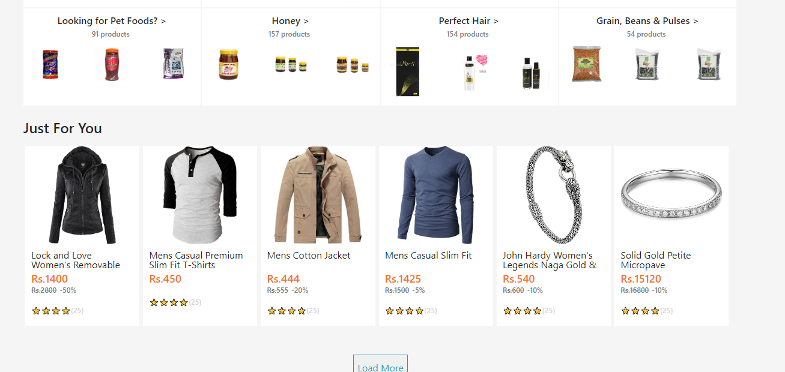
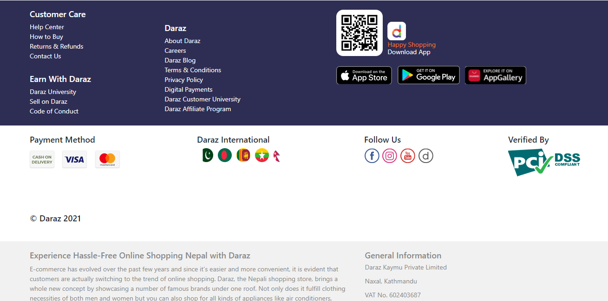
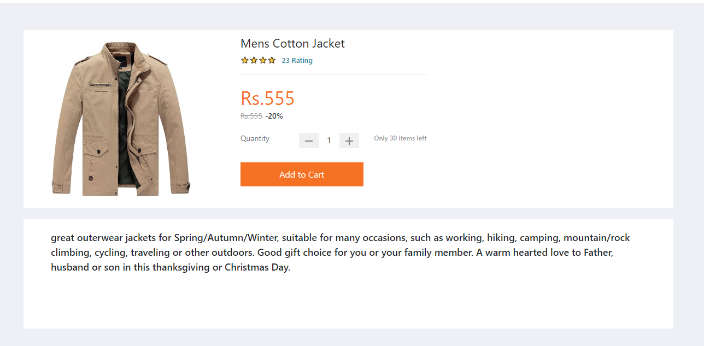

# Daraz Landing Page

It is UI Clone of Daraz an ecommerce platform. It is 
for the people who want to get reference of developing 
UI using React, CSS, Consuming Rest Api and Developing 
backend with Database.


## Demo

https://daraz-clone.vercel.app/

## Screenshots






## Technology

1. React Js
2. Node JS
3. Mongodb


## Run Locally

Clone the project

```bash
  git clone https://github.com/sarojdahal8848/daraz-landing-page.git
```

Go to the project directory

```bash
  cd daraz-landing-page
```
Go to the Client directory

```bash
  cd client
```

Install dependencies (For Client)

```bash
  npm install
```

Start the server

```bash
  npm start
```


Go to the Server directory

```bash
  cd server
```

Install dependencies (For Server)

```bash
  npm install
```

Start the server

```bash
  npm start
```

## Environment Variables

To run this project, you will need to add the following environment variables to your .env file (inside server directory)

`PORT`

`NODE_ENV`

`DB_URI`

## Author

- [Saroj Dahal](https://github.com/sarojdahal8848)

